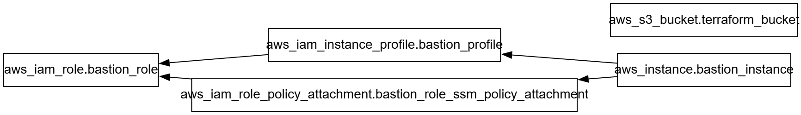

# Chapter 3: Terraform Logics & Dynamics
Now that we have learnt the various data types Terraform can support, we can finally learn about applying logics to your Terraform code so it can be more dynamic than what you initially thought it can be. We will be covering loops, conditions, and dependency handling in this chapter.

## A. Loops
Terraform has always tried to introduce the concept of DRY (Don't Repeat Yourself) which to some extent are quite doable. Creating multiple resource block that essentially have the same template with just different identifier repeatedly is sometimes tedious to do especially when the numbers skyrocketed (Imagine having to repeat thousands of A record resource one by one - naming the resource block one by one is also another nightmare).To address this, Terraform introduced ways to do loops in order to reduce repetition in code.

### 1. Block-level Loop with Meta-arguments
This may be a bit late to introduce, but Terraform has something called meta-arguments, which are special arguments defined by Terraform language itself (unlike other normal arguments where they're defined by provider specifications) which allows you to manage how the block is treated by Terraform. This includes looping mechanism, which means you can tell to create X amount of ec2 instance with a certain template just by defining one meta-argument line. There are other meta-arguments for other purposes, but for now we'll be focusing on the meta-arguments used for loop mechanism.

There are two approach for looping with meta-arguments, which have their own nuances. You cannot use both of them at the same time, so you need to choose one based on the use case.
#### count
This is essentially a `for i = 0; i < range; i++` kind of loop meta-argument. This tells Terraform to create the block X times based on the value passed to count. The result of the block will be an array (list) with the data type being the block itself. This means that you can access the block like how you access a list, like `aws_instance.these_instances[index]` with index ranging `0-{range-1}`. If you ever need to reference the current index in the argument for whatever use case (usually for naming scheme), you can call the value by referring to `count.index` which will return the current index of the count loop.

```
resource "aws_instance" "these_instances"{
	count = 2
	...
	tags = { Name = "instance-${count.index}"}
}
```
This is how a resource block with count looks like. This tells the Terraform to create two aws_instance resource with the name `instance-0` and `instance-1`. You can do this with data and module block as well.

If you ever want to reference a certain attribute values of `these_instances` resources as whole, there's a trick using splat operator(`[*]`) for count-based block. Here's an example of how you can do it to create a reference point of `instance_ids` of all `aws_instance` as an output:
```
output "instance_ids"{
	value = aws_instance.these_instances[*].id
}
```

#### for_each
Another archetype of loop which is essentially `for i in [set]/{map/object}` type. This tells Terraform to create the block X times based on the list of keys in the set/map/object, with the keys being the identifier of the block. This mean that you can access the value similar to how you access a map, like `aws_instance.these_instances["key"]`. This meta-arguments only accept set and map as input, so if you pass a list to this argument, you will need to use `toset()` function beforehand. If you want to access the keys as reference, you can use the keyword `each.key`, while if you want to access the elements within the map, you can use the keyword `each.value` instead. When you pass a set to the `for_each`, the `key` and `value` will have the same value when accessed, though it's best practice to just use `each.key` to keep your codes cleaner.

```
resource "aws_instance" "these_instances"{
	for_each = {
		"app-1" = {
			instance_type = "t3.micro"
			ami = "ami-xxxxxx"
		}
		"app-2" = {
			instance_type = "t3.medium"
			ami = "ami-xxxxxx"
		}
	}
	...
	instance_type = each.value.instance_type
	ami = each.value.ami
	tags = {Name = each.key}
}
```
This is how a resource block with for_each looks like, which will tell Terraform to create two aws_instance resource with the name `app-1` and `app-2` with the instance type and ami defined in the map. Similar to count, you can do this on data and module block as well.

To reference the certain attributes of `these_instances` as whole, you cannot use the splat operator like how count does this. There's another trick which will be explained later in another section, using **in-line value-level loop with for**.

### 2. Configuration-level Loop with Dynamic
There is another level of dynamically configuring your Terraform code, which is enabling a configuration level loop using the keyword `dynamic`. Some resource types includes *repeatable nested blocks* in their arguments, and `dynamic` allows you to transform the list of repeated nested blocks in the from of a loop which can simplify the blocks by a lot. This keyword utilize the same logic as for_each, which will iterate the block based on given set or map. Below are the example of how dynamic expression are used.

```
locals {
  extra_disks = [
    {
      device_name = "/dev/sdb"
      size        = 10
      type        = "gp3"
    },
    {
      device_name = "/dev/sdc"
      size        = 20
      type        = "gp3"
    }
  ]
}

resource "aws_instance" "web_server" {
  ...
  root_block_device {
    volume_size = 8
    volume_type = "gp3"
  }

  dynamic "ebs_block_device" {
    for_each = local.extra_disks
    content {
      device_name = ebs_block_device.value.device_name
      volume_size = ebs_block_device.value.size
      volume_type = ebs_block_device.value.type
      encrypted   = true
    }
  }
}
```

To use the dynamic expression, you will need to define the for_each which will determine your iterator keys, and content block which are the template of the configurations you need within the nested block. As you can see, this will create two additional ebs volumes (not including the root volume) using the values passed on  `local.extra_disks` using the `ebs_block_device` block. Also, one notable difference between for_each as meta-arguments and in dynamic expression is that to access the keys and values passed to the dynamic expression, we will be using `block_name.key/block_name.value` instead of `each.key/each.value`. Do note that `block_name` is determined by providers so check the providers documentation to know which resource needs `dynamic` keyword

### 3. In-line Value-level Loop with for
Other than dynamic, you can also define a value-level loop using the `for` expression. This is an in-line loop expression designed to assign values into list or map format based from the passed collection data type (map, list, set). This can be used to parse a complex map into a simpler format or as mentioned before, to transform a set into a list or define the output for a for_each generated attributes. Below are the example of the usage of for expression.

```
# output will return key-value map of instance key & instance id
output "instance_ids" {
	value =  { for i in these_instances : i.key =>  i.value.id }
}

# simplifytest will generate list of names ["test", "home", ...]
local {
	test =[{Name="test"}, {Name="home"}, ...]
	simplifytest = [ for i in test : i.value.Name ]
}
```

## B. Conditions
There are moments where you might feel like having an if-else statement can be helpful when developing a Terraform code. There are two different spots which you can define conditions in Terraform, which is in-line value conditional expression and variable input validation. Below are the explaination for methods to apply conditions in Terraform.
### 1. Conditional Expression
Conditional Expression are one of the way to create an if-else for a certain value. The semantics followed C++'s style of ternary conditional operator, which is basically `statement_is_true ? return_true_val : return_false_value`. This is given but statement should be a boolean value or at least return a boolean value, which will let Terraform decide which value to return. You can also nest the statements to make an elif statement if you want.

One thing that has yet to be mentioned yet, Terraform does support some mathematical (+,-, *, /) or logic operators (>, <. ==, &&, ||, etc) and you can actually play around the logic operator to express the boolean value. Below are the example of  how to utilize the conditional expression.

```
module "this_module"{
	source = "/path/to/module"
	count = var.create_module == true ? 1 : 0
	...
}
```
This will  set the count to 1 and create `module.this_module` when `var.create_module` value equals to true, and will set the count to 0 and not create the module if `var.create_module` isn't equal to true. It's given but you don't actually need the `==` operator, but it's just a demonstration of using logical expression in Terraform.

### 2. Variable Validation
Other place to define a certain condition is within the variable itself, which has the capability to check whether a certain variable has met the criteria of the accepted value and restrict the input to what we have defined. To do this, we can define a nested block in the variable called `validation` which has the arguments `condition` & `error_message`. Within the condition, we will be passing an boolean expression and if it returns false, the error message will be triggered during a terraform action (plan/apply). Below are the example of how to utilize this feature.
```
variable "env" {
  description = "Environment (dev, stage, or prod)"
  type        = string

  validation {
    condition     = contains(["dev", "stage", "prod"], var.env)
    error_message = "Environment must be one of: dev, stage, or prod."
  }
}

variable "instance_count" {
  type        = number
  description = "The number of instances to create (between 1 and 10)."

  validation {
    condition     = var.instance_count >= 1 && var.instance_count <= 10
    error_message = "Instance count must be between 1 and 10."
  }
}
```
In the first function, the condition is the return value of the function `contains()`, which will check whether `var.env` value is `dev`, `stage`, or `prod`. If it is not between any of them, it will return the error. If it's between any of them, it will pass normally.

In the second function, the condition is that `instance_count` should be between 1-10. If it's any more than 10 or less than 1, the boolean expression will return false and trigger the error message.

## C. Dependency Handling
As you may have observed in the previous sample lab, Terraform has a smart process to handle which resources go first or which resource goes later, with the concept called dependencies. Basically this is a mechanism for choosing the order of creation for resources, determining which resource has to be created before able to create the other resource, and which resources have interchangeability when it comes to the order. Terraform has an interesting command called `terraform graph` which can show the relationships between entities in a Terraform root module.

This command outputs a text-based graph in DOT language, which is a standardized format used by GraphViz. There are various tools to visualize the graph (you can ask GPT about this), but here is an example of the dependency graph in Lab 1 script.

As we can see, Terraform has recognized that `bastion_instance` depended on `bastion_profile` to be created, which in turns depended on `bastion_role` being created as well. On the other hand, it's also established that the ssm policy attachment depends on `bastion_role` as well. This means that regardless of the order of typing, Terraform will still always create `bastion_role` first, then create `bastion_profile` and the policy attachment, and once `bastion_profile` is created, only then will it create the bastion_instance. Also, observe that terraform_bucket does not have any arrows coming from/to the block. This means that it does not depends on anyone to be created, which means Terraform can create S3 bucket at any point of the time during the apply without breaking the process (which were the aim). This relationship is all handled by Terraform by seeing the attribute references one resource make to the other, which Terraform is plenty smart enough to solve the dependency map. This is called implicit dependencies, where by referencing attributes of another block it is automatically marked a "dependent resource"

So far, we have seen how Terraform handled dependencies implicitly based on attribute references. However, what if we want to make sure that the policy has to be attached by the time `bastion_instance` is created? What if we want to make sure the S3 bucket is created beforehand due to the bastion (let's say) having the purpose to dump file to the bucket in the defined in the user_data (it's not, but let's just assume it is for the case)? That's where explicit dependencies comes in handy.

You can use the meta-argument `depends_on = []` to explicitly define which block depends on which blocks. Here is an example using the previous lab's code.
```
resource "aws_instance" "bastion_instance" {
  ami           = "ami-078462934228fde0e"
  instance_type = "t4g.small"
  iam_instance_profile = aws_iam_instance_profile.bastion_profile.name
   ...
  depends_on = [ aws_iam_role_policy_attachment.bastion_role_ssm_policy_attachment ]
}

resource "aws_iam_role_policy_attachment" "bastion_role_ssm_policy_attachment" {
  role       = aws_iam_role.bastion_role.name
  policy_arn = "arn:aws:iam::aws:policy/AmazonSSMManagedInstanceCore"
}
```

Now look at the changes it does to the graph

The explicit dependency added an arrow from `bastion_instance` to the policy attachment. This made sure that `bastion_instance` will never be created before the policy is attached properly, even with no attribute reference made from the policy attachment to `bastion_instance`.